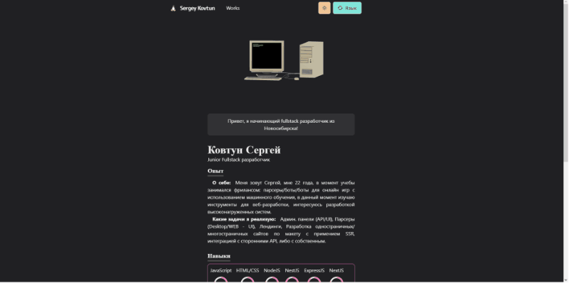

# My homepage

> Written with helps <svg role="img" viewBox="0 0 24 24" xmlns="http://www.w3.org/2000/svg" width="20" height="20" fill="#fff"><title>Next.js</title><path d="M11.5725 0c-.1763 0-.3098.0013-.3584.0067-.0516.0053-.2159.021-.3636.0328-3.4088.3073-6.6017 2.1463-8.624 4.9728C1.1004 6.584.3802 8.3666.1082 10.255c-.0962.659-.108.8537-.108 1.7474s.012 1.0884.108 1.7476c.652 4.506 3.8591 8.2919 8.2087 9.6945.7789.2511 1.6.4223 2.5337.5255.3636.04 1.9354.04 2.299 0 1.6117-.1783 2.9772-.577 4.3237-1.2643.2065-.1056.2464-.1337.2183-.1573-.0188-.0139-.8987-1.1938-1.9543-2.62l-1.919-2.592-2.4047-3.5583c-1.3231-1.9564-2.4117-3.556-2.4211-3.556-.0094-.0026-.0187 1.5787-.0235 3.509-.0067 3.3802-.0093 3.5162-.0516 3.596-.061.115-.108.1618-.2064.2134-.075.0374-.1408.0445-.495.0445h-.406l-.1078-.068a.4383.4383 0 01-.1572-.1712l-.0493-.1056.0053-4.703.0067-4.7054.0726-.0915c.0376-.0493.1174-.1125.1736-.143.0962-.047.1338-.0517.5396-.0517.4787 0 .5584.0187.6827.1547.0353.0377 1.3373 1.9987 2.895 4.3608a10760.433 10760.433 0 004.7344 7.1706l1.9002 2.8782.096-.0633c.8518-.5536 1.7525-1.3418 2.4657-2.1627 1.5179-1.7429 2.4963-3.868 2.8247-6.134.0961-.6591.1078-.854.1078-1.7475 0-.8937-.012-1.0884-.1078-1.7476-.6522-4.506-3.8592-8.2919-8.2087-9.6945-.7672-.2487-1.5836-.42-2.4985-.5232-.169-.0176-1.0835-.0366-1.6123-.037zm4.0685 7.217c.3473 0 .4082.0053.4857.047.1127.0562.204.1642.237.2767.0186.061.0234 1.3653.0186 4.3044l-.0067 4.2175-.7436-1.14-.7461-1.14v-3.066c0-1.982.0093-3.0963.0234-3.1502.0375-.1313.1196-.2346.2323-.2955.0961-.0494.1313-.054.4997-.054z"/></svg>, <svg role="img" viewBox="0 0 24 24" xmlns="http://www.w3.org/2000/svg" width="20" height="20" fill="#319795"><title>Chakra UI</title><path d="M12 0C5.352 0 0 5.352 0 12s5.352 12 12 12 12-5.352 12-12S18.648 0 12 0zm2.8 4.333c.13-.004.248.136.171.278l-3.044 5.58a.187.187 0 00.164.276h5.26c.17 0 .252.207.128.323l-9.22 8.605c-.165.154-.41-.063-.278-.246l4.364-6.021a.187.187 0 00-.151-.296H6.627a.187.187 0 01-.131-.32l8.18-8.123a.182.182 0 01.125-.056z"/></svg>, <svg role="img" viewBox="0 0 24 24" xmlns="http://www.w3.org/2000/svg" width="20" height="20" fill="#3178c6"><title>TypeScript</title><path d="M1.125 0C.502 0 0 .502 0 1.125v21.75C0 23.498.502 24 1.125 24h21.75c.623 0 1.125-.502 1.125-1.125V1.125C24 .502 23.498 0 22.875 0zm17.363 9.75c.612 0 1.154.037 1.627.111a6.38 6.38 0 0 1 1.306.34v2.458a3.95 3.95 0 0 0-.643-.361 5.093 5.093 0 0 0-.717-.26 5.453 5.453 0 0 0-1.426-.2c-.3 0-.573.028-.819.086a2.1 2.1 0 0 0-.623.242c-.17.104-.3.229-.393.374a.888.888 0 0 0-.14.49c0 .196.053.373.156.529.104.156.252.304.443.444s.423.276.696.41c.273.135.582.274.926.416.47.197.892.407 1.266.628.374.222.695.473.963.753.268.279.472.598.614.957.142.359.214.776.214 1.253 0 .657-.125 1.21-.373 1.656a3.033 3.033 0 0 1-1.012 1.085 4.38 4.38 0 0 1-1.487.596c-.566.12-1.163.18-1.79.18a9.916 9.916 0 0 1-1.84-.164 5.544 5.544 0 0 1-1.512-.493v-2.63a5.033 5.033 0 0 0 3.237 1.2c.333 0 .624-.03.872-.09.249-.06.456-.144.623-.25.166-.108.29-.234.373-.38a1.023 1.023 0 0 0-.074-1.089 2.12 2.12 0 0 0-.537-.5 5.597 5.597 0 0 0-.807-.444 27.72 27.72 0 0 0-1.007-.436c-.918-.383-1.602-.852-2.053-1.405-.45-.553-.676-1.222-.676-2.005 0-.614.123-1.141.369-1.582.246-.441.58-.804 1.004-1.089a4.494 4.494 0 0 1 1.47-.629 7.536 7.536 0 0 1 1.77-.201zm-15.113.188h9.563v2.166H9.506v9.646H6.789v-9.646H3.375z"/></svg>, <svg role="img" viewBox="0 0 24 24" xmlns="http://www.w3.org/2000/svg" width="20" height="20" fill="#fff"><title>Three.js</title><path d="M.38 0a.268.268 0 0 0-.256.332l2.894 11.716a.268.268 0 0 0 .01.04l2.89 11.708a.268.268 0 0 0 .447.128L23.802 7.15a.268.268 0 0 0-.112-.45l-5.784-1.667a.268.268 0 0 0-.123-.035L6.38 1.715a.268.268 0 0 0-.144-.04L.456.01A.268.268 0 0 0 .38 0zm.374.654L5.71 2.08 1.99 5.664zM6.61 2.34l4.864 1.4-3.65 3.515zm-.522.12l1.217 4.926-4.877-1.4zm6.28 1.538l4.878 1.404-3.662 3.53zm-.52.13l1.208 4.9-4.853-1.392zm6.3 1.534l4.947 1.424-3.715 3.574zm-.524.12l1.215 4.926-4.876-1.398zm-15.432.696l4.964 1.424-3.726 3.586zM8.047 8.15l4.877 1.4-3.66 3.527zm-.518.137l1.236 5.017-4.963-1.432zm6.274 1.535l4.965 1.425-3.73 3.586zm-.52.127l1.235 5.012-4.958-1.43zm-9.63 2.438l4.873 1.406-3.656 3.523zm5.854 1.687l4.863 1.403-3.648 3.51zm-.54.04l1.214 4.927-4.875-1.4zm-3.896 4.02l5.037 1.442-3.782 3.638z"/></svg> and styled-components.

> You can see my [homepage](https://www.ikbkr.site).

# Preview

# Local Deploying

> With docker-compose: run in terminal `docker-compose up --build -d` and check in browser on *http://localhost:3000*.

> Local deploy with yarn:
- `yarn`
- `yarn dev`
> and then check in browser on http://localhost:3000
